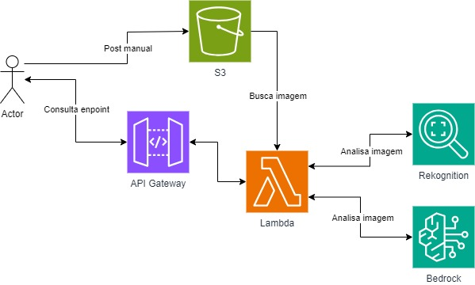

# API para detecção de emoções em faces e geração de dicas para tutores de pets

A API tem como objetivo realizar a detecção de emoções em faces presentes em imagens enviadas como parâmetros. Assim como detectar a raça e gerar dicas à respeito de saúde e comportamento de seus pets através do envio de uma imagem do animal.

## Índice
1. [Rotas](#rotas)
2. [Parâmetros](#parâmetros)
3. [Como utilizar](#como-utilizar)
5. [Desenvolvimento](#desenvolvimento)
6. [Tecnologias utilizadas](#tecnologias-utilizadas)
6. [Modelo utilizado](#modelo-utilizado)
7. [Arquitetura na AWS](#arquitetura-na-aws)
8. [Estrutura de pastas e arquivos](#estrutura-de-pastas-e-arquivos)
9. [Dificuldades conhecidas](#dificuldades-conhecidas)
10. [Testes](#testes)
11. [Desenvolvedores](#desenvolvedores)
***

## Rotas
A API possui as seguintes rotas disponíveis na URL:
```bash
https://etmhu1hkd0.execute-api.us-east-1.amazonaws.com
```

### Rota 1 → GET /
- Retorno esperado:
```json
{
   "message": "Go Serverless v3.0! Your function  executed successfully!",
   "input": { 
       ...(event)
     }
}
```

### Rota 2 → GET /v1
- Retorno esperado:
```json
{ 
   "message": "VISION api version 1." 
} 
```

### Rota 3 → GET /v2
- Retorno esperado:
```json
{ 
   "message": "VISION api version 2." 
} 
```

### Rota 4 -> POST /v1/vision
Rota para detecção de emoções em faces presentes na imagem enviada como parâmetro.
- A imagem deve estar armazenada em um bucket do AWS S3
- Retorno esperado:
```json
{ 
   "url_to_image": "https://myphotos/test.jpg", 
   "created_image": "02-02-2023 17:00:00", 
   "faces": [ 
     { 
      "position": 
      { 
       "Height": 0.06333330273628235, 
       "Left": 0.1718519926071167, 
       "Top": 0.7366669774055481, 
       "Width": 0.11061699688434601 
      } 
      "classified_emotion": "HAPPY", 
      "classified_emotion_confidence": 99.92965151369571686 
     } 
   ] 
} 
```

### Rota 5 -> POST /v2/vision
Rota para a elaboração de dicas de saúde e comportamento de pets enviados através de imagens como parâmetro.
- A imagem deve possuir o formato `.jpg`, `.jpeg` ou `.png` e estar armazenada em um bucket do AWS S3
- Retorno esperado:
```json  
{
   "url_to_image": "https://sprint-8-equipe-1.s3.amazonaws.com/husky.jpg",
   "created_image": "04-05-2024 22:16:49",
   "labels": [
       {
           "Confidence": 99.99998474121094,
           "Name": "Dog"
       },
       {
           "Confidence": 99.99998474121094,
           "Name": "Husky"
       },
       {
           "Confidence": 99.99998474121094,
           "Name": "Animal"
       },
       {
           "Confidence": 99.99998474121094,
           "Name": "Canine"
       }
   ],
   "Dicas": "  Dicas sobre Husky:  - Nível de Energia e Necessidades de Exercícios: O Husky é uma raça de cão com alto nível de energia e necessidades de exercícios. Eles precisam de pelo menos 1 hora de exercício intenso por dia, como correr, caminhar ou jogar.  - Temperamento e Comportamento: O Husky é conhecido por ser um cão amigável, extrovertido e ativo. Eles são inteligentes e podem ser independentes, o que pode tornar o treinamento um desafio. Eles também são conhecidos por serem vocais e podem uivar ou latir frequentemente.  - Cuidados e Necessidades: O Husky tem uma pelagem espessa e dupla que precisa ser escovada regularmente para evitar enrolamentos e acúmulo de pelos soltos. Eles também precisam de uma dieta equilibrada e saudável para manter sua energia e saúde.  - Problemas de Saúde Comuns: O Husky pode ser suscetível a alguns problemas de saúde comuns, como displasia de quadril, cataratas e problemas oculares. É importante manter o cão em um peso saudável e fazer check-ups regulares com um veterinário para monitorar sua saúde."
}  
```

***
## Parâmetros
As rotas POST disponíveis na API necessitam do envio dos parâmetros `bucket` e `imageName`, conforme exemplo abaixo:
```json
{ 
   "bucket": "bucket", 
   "imageName": "imageName.jpg" 
}
```
***

## Como utilizar
É possível utilizar a aplicação em ambiente de produção e localmente. Para isso, basta seguir os passos indicados a seguir.

### Em produção

- Utilizando uma ferramenta de cliente HTTP, como o [Postman](https://www.postman.com/) ou [Insomnia](https://insomnia.rest/), faça as requisições à rota desejada ([rotas disponíveis](#rotas)).
> Nas rotas `/v1/vision` e `/v2/vision` é necessário o envio dos parâmetros indicados no tópico [Parâmetros](#parâmetros) 


### Local

1. Clone o repositório
```bash
git clone git@github.com:Compass-pb-aws-2024-IFSUL-UFERSA/sprint-8-pb-aws-ifsul-ufersa.git
```

2. Mude para a branch grupo-1
```bash
git switch grupo-1
```

3. Instale o serverless
```bash
npm install -g serverless
```

4. Vá para a pasta visao-computacional
```bash
cd visao-computacional
```

5. Instale o plugin do serverless-offline
```bash
serverless plugin install -n serverless-offline
```

6. Inicie o serverless-offline
```bash
serverless offline
```

7. As rotas geradas serão mostradas no console

***

## Desenvolvimento

No desenvolvimento deste projeto, adotamos uma abordagem organizada, utilizando o Trello para dividir e acompanhar as tarefas entre os membros da equipe. O código foi estruturado seguindo os princípios da programação orientada a objetos, garantindo uma arquitetura sólida e modular. A linguagem utilizada foi Python, com o Serverless Framework para gerenciar as funções lambda de forma eficiente. Para a análise de imagens, foi utilizado o Amazon Rekognition, aproveitando sua capacidade avançada de reconhecimento visual. Além disso,  para a elaboração de dicas à respeito dos pets, foi utilizado o modelo de IA generativa Mistral Large, disponível no Amazon Bedrock.

***

## Tecnologias utilizadas
<div style="display: inline_block">

  <table border="1">
    <tr><th>Tecnologia</th>
      <td align="center"> <a href="https://developer.mozilla.org/en-US/docs/Web/python"></a> Python</td>
      <td align="center"> <a href="https://www.serverless.com/framework/docs"></a> Serverless</td>
      <td align="center"> <a href="https://boto3.amazonaws.com/v1/documentation/api/latest/index.html"></a> Boto3</td>
      <td align="center"> <a href="https://boto3.amazonaws.com/v1/documentation/api/latest/index.html"></a>Rekognition</td>
      <td align="center"> <a href="https://boto3.amazonaws.com/v1/documentation/api/latest/index.html"></a>Bedrock</td>
      <td align="center"> <a href="https://boto3.amazonaws.com/v1/documentation/api/latest/index.html"></a>CloudWatch</td>
      <td align="center"> <a href="https://boto3.amazonaws.com/v1/documentation/api/latest/index.html"></a>S3</td>
      <td align="center"> <a href="https://boto3.amazonaws.com/v1/documentation/api/latest/index.html"></a>Lambda</td>
   
</tr>
    <tr><th>Versão</th>
      <td align="center">3.12.2</td>
      <td align="center">3.38.0</td>
      <td align="center">1.34.68</td>
      <td align="center">Current</td>
      <td align="center">Current</td>
      <td align="center">Current</td>
      <td align="center">Current</td>
      <td align="center">Current</td>
    </tr>
  </table>
</div>

***

## Modelo utilizado
Optamos pelo modelo de IA generativa Mistral Large, disponível no Amazon Bedrock, devido à sua capacidade de fornecer respostas detalhadas e bem formatadas dentro do tempo aceitável para as necessidades do projeto. Essa escolha foi feita após avaliação de diversas opções, considerando a eficiência e qualidade na geração de conteúdo exigidas pelo contexto do problema. O Mistral Large destacou-se por sua habilidade em compreender e sintetizar informações complexas, tornando-o a opção ideal para atender às exigências do projeto de forma rápida e precisa.
***
## Arquitetura na AWS



***
## Estrutura de pastas e arquivos
```
/sprint-8-pb-aws-ifsul-ufersa
├── README.md
├── assets
|  └── arquitetura-base.jpg
├── tests
|  └── testAPI.postman_collection.json
└── visao-computacional
   ├── Controllers
   |  ├── Home.py
   |  ├── V1Description.py
   |  ├── V1Vision.py
   |  ├── V2Description.py 
   |  └── V2Vision.py
   ├── Handler.py
   ├── package-lock.json
   ├── package.json
   └── serverless.yml
```

- [`visao-computacional/Controllers/`](./visao-computacional/Controllers): Diretório que possui as rotas do projeto
- [`visao-computacional/Controllers/Home.py`](./visao-computacional/Controllers/Home.py): Rota raiz do projeto
- [`visao-computacional/Controllers/V1Description.py`](./visao-computacional/Controllers/V1Description.py): Rota de descrição da v1
- [`visao-computacional/Controllers/V1Vision.py`](./visao-computacional/Controllers/V1Vision.py): Rota para análise de sentimento
- [`visao-computacional/Controllers/V2Description.py`](./visao-computacional/Controllers/V2Description.py): Rota de descrição da v2
- [`visao-computacional/Controllers/V2Vision.py`](./visao-computacional/Controllers/V2Vision.py): Rota para análise de animais e pets
- [`visao-computacional/Handler.py`](./visao-computacional/handler.py): Arquivo que faz o controle das rotas
- [`visao-computacional/serverless.yml`](./visao-computacional/serverless.yml): Arquivo que faz o controle do serverless
- [`assets/`](/assets/): Diretório que contem os arquivos utilizados nesse readme.
- [`tests/`](/tests/): Diretório que contem o arquivo para testagem no postman.

***
## Dificuldades conhecidas
Abaixo, destacamos as principais dificuldades encontradas no decorrer do projeto:
-  Encontro do modelo ideal
-  Tratamento dos labels oriundos do Rekognition

***
## Testes
O projeto conta com um arquivo para testagem completa da API no postman, disponível para download na pasta `tests`.
***

## Desenvolvedores
- Arthur Garcia
- Lucas Gobel
- Rafael Neves
- Rafael Oliveira
